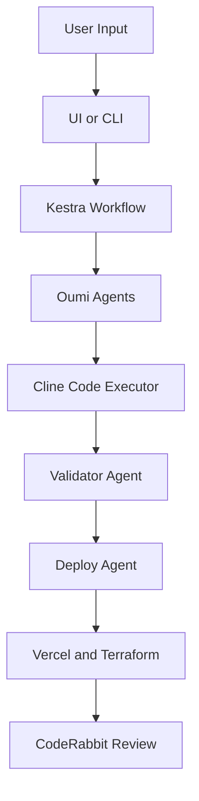

# AutoInfra

> **AI-native DevOps engine that converts natural language into production-ready infrastructure**

Describe what you want, and AutoInfra designs the architecture, generates Terraform or Vercel configs, validates them, writes the files using Cline, deploys them through Kestra and Vercel, and reviews the generated code with CodeRabbit.

AutoInfra removes the need for manual DevOps work. It turns infrastructure from a slow and complex process into a simple conversation.

---

## Why AutoInfra

Modern developers struggle with cloud complexity, scattered configuration formats, and slow deployment pipelines. AutoInfra solves this by providing one unified system that performs five major functions:

- **Understand** natural language specifications
- **Design** complete cloud architecture
- **Generate** configuration files and infrastructure code
- **Validate** everything for correctness and safety
- **Execute** deployments and auto-review the output

**AutoInfra is the first fully autonomous DevOps system powered by a multi-agent architecture.**

---

## Core Features

### Natural Language to Infrastructure

Type instructions such as:

```bash
Deploy a FastAPI backend with Postgres, Redis cache, 
staging pipeline, monitoring and autoscaling.
```

AutoInfra converts this into a complete blueprint.

### Multi-Agent Architecture

AutoInfra uses four specialized **Oumi** agents:

#### **Infra Designer Agent**
Interprets user input and creates the full architecture model.

#### **Infra Generator Agent**
Generates Terraform, serverless files, Vercel config, Docker files and diagrams.

#### **Validator Agent**
Ensures correctness with linting, schema checks and cloud compatibility rules.

#### **Deploy Agent**
Deploys the final infrastructure using Vercel or Terraform and streams logs.

### Cline Powered Code Execution

Cline writes the generated files into the `infra` folder, applies patches, and organizes the folder structure.

### 🔄 Kestra Orchestrated Pipelines

Kestra coordinates all agents and tasks. It is the central workflow engine for AutoInfra.

### 🔍 Auto Review with CodeRabbit

Whenever code is generated, a Git PR is opened and CodeRabbit provides a complete automated review.

### 🎯 Two Interaction Modes

Use either the **UI** or the **CLI** to interact with AutoInfra.

---

## System Architecture



**Flow Overview:**

```
User Input → UI/CLI → Kestra Workflow → Oumi Agents → 
Cline Code Executor → Validator Agent → Deploy Agent → 
Vercel/Terraform → CodeRabbit Review
```

---

## Repository Structure

```
autoInfra/
├── apps/
│   ├── dashboard/          # Next.js UI
│   ├── orchestrator/       # Kestra workflows
│   └── cli/                # autoinfra CLI
│
├── packages/
│   ├── agents/             # Oumi agents
│   ├── prompts/            # Prompt templates
│   ├── schemas/            # Infra schemas
│   └── utils/              # Shared utilities
│
├── infra/
│   ├── generated/          # Code written by Cline
│   └── deployments/        # Deploy artifacts
│
└── turbo.json
```

---